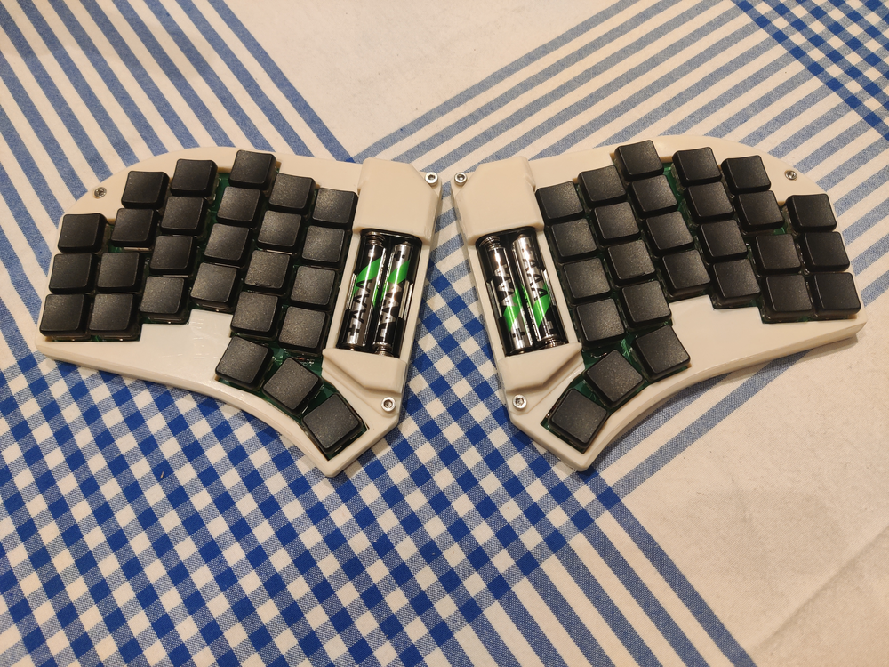

# Badfinger

__Would not recommend building__, as I made a lot of design mistakes, but it is possible. 
It's a 52 key low-profile keyboard, with slightly bigger than choc spacing, powered by regular batteries. 
Ultimately, I wanted a wireless split powered by regular 1.2V AAA batteries, and it's what I got.

The most interesting takeaway here is that the R-78S3.3-0.1 is a really handy part for making battery powered things.

## Materials
__2x PCBs__

__2x XIAO nRF52840__  

__2x Keystone 2468 Battery holder__

__2x R-78S3.3-0.1 DC-DC converter__

Finally, some m3x10, m3x6, m3 square nuts, m2x8 self tapping screws, and wires for the assembly. 
There's also a 2.2uF cap and 1uH inductor, but, I think the inductor could be replaced by a wire and the cap skipped with no real harm done, though don't quote me on that.

The DC-DC converter won't fit in it's footprint, but needs to be connected with wires and placed just below the battery holder. Looking at the case std should make it fairly clear where it goes.
