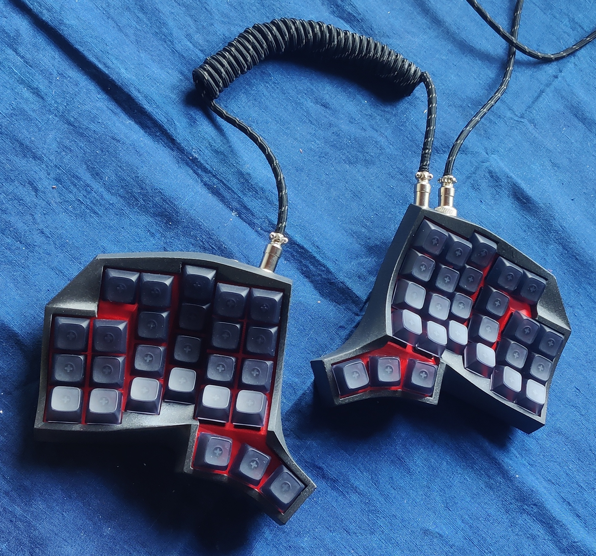
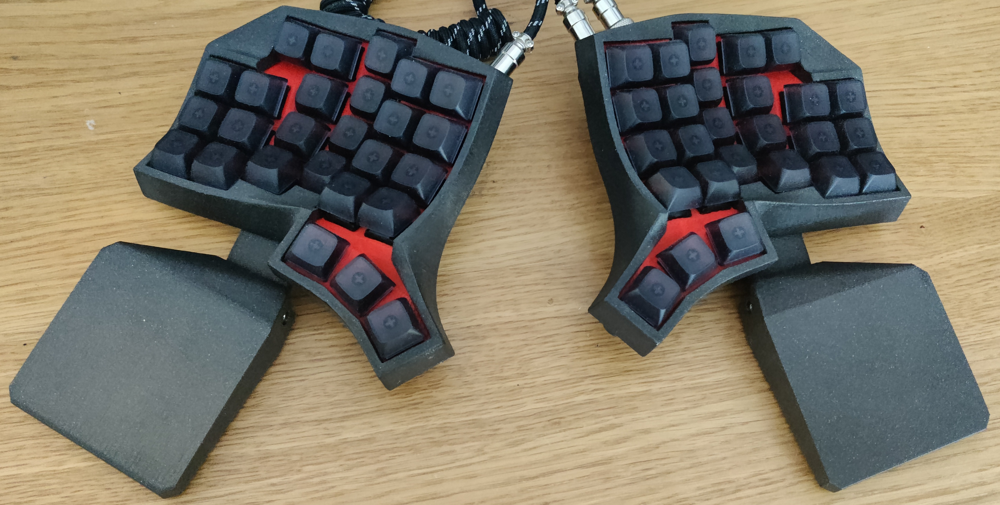
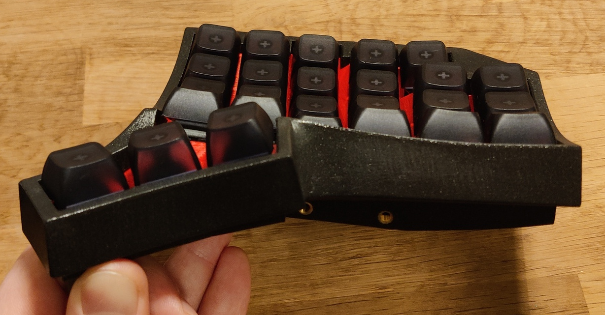
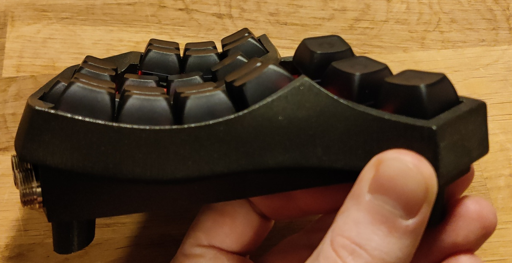
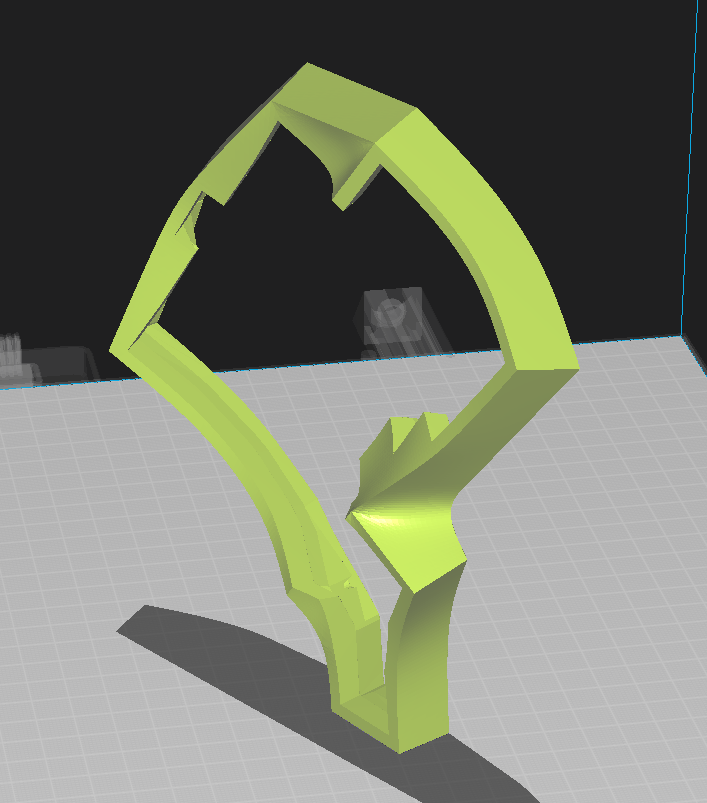
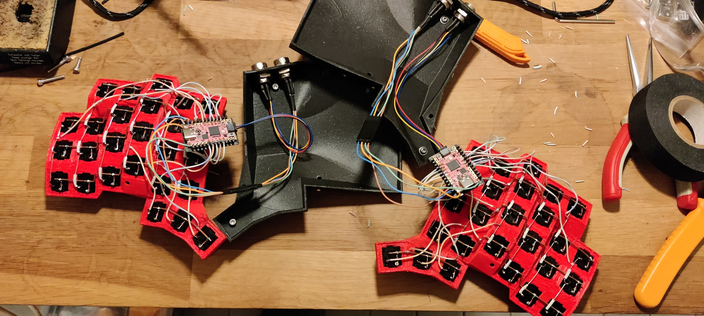

# Powerspill

Yet another curved keywell handwired build. I wasn't quite happy with my previous design(s) and I found that for a curved keywell board, my hands are big enough to reach a fourth row without issues, which might further ease transition to it. Whether it's actually needed is a different question, but having extra buttons on a non-portable keyboard doesn't really detract from its functionality. Though, after using it for a bit, I think I could've been ok without the fourth row.

__Design thoughts__
- The stagger is a mix of vertical and back to front.
- Pinky keys are slightly closer together than the others
- Each column is arranged such that it is flatter on the far end than on the close end. If you assume that the pressing of a button is primarily a movement around the base join of each finger, I think this aligns they button travel better with the motion of the fingers when pressing.
- The thumb cluster angle is reduced compared to my previous design. I found that pressing thumb keys with the side of the thumb (much like a normal spacebar) just feels better to me.
- The keys are a bit farther apart than on my previous design, at 17.5 mm vertical (16.5 for pinkies) and ~19 mm horizontal. While putting them closer reduces finger travel, It just caused too many misclicks for me.

I used openscad to layout the keys (with a bit of python codegen to layout the positions in each column). The scad file was used to layout squares with keyholes in their correct positions. Using blender, I then manually connnected up all the keyholes to form the plate (this is tedious). For the top case, I took a similar approach, where openscad was used to place blocks that outline the key border (same positioning code can be reused). The blocks were manually connected to make a low-poly version of the top hull, and then a subdivision surface modifier (and manually marked sharp edges) was used to smoothen all the surfaces that should be curved. Finally, a lot of boolean cutout steps were used for bolt-holes, hollowing out, etc. I'm not a blender expert, so this might not be the best way to go about it, but the blender files (including a bunch of discarded attempts) are included.

## 3d printing
Most parts require supports but use your own judgement. For the top part, it can be printed standing up to minimize the amount of supports needed as well as orienting the layer lines nicely (still needs supports though).

## Build
The connectors are GX12. at least 3 pin connectors are required for the between-half connectors, and at least four pins are needed for the usb connector. I would recommend picking a different number of pins to eleminate the risk of accidentally plugging it wrong and breaking something. Assembly requires some M3 bolts (mixed lengths between 8-20 are needed) and heatset inserts. The keys click into the plate, and the plate is then sandwiched between the top and bottom case during assembly. In theory, the board should support the use of per-key PCBs (amoeba or similar), but I haven't tested the tolerances.

The wristrest and feet are designed to lie flat with rubber feet that are 3mm thick. It might work without rubber feet or with other thicknessess, but I haven't tested it.
