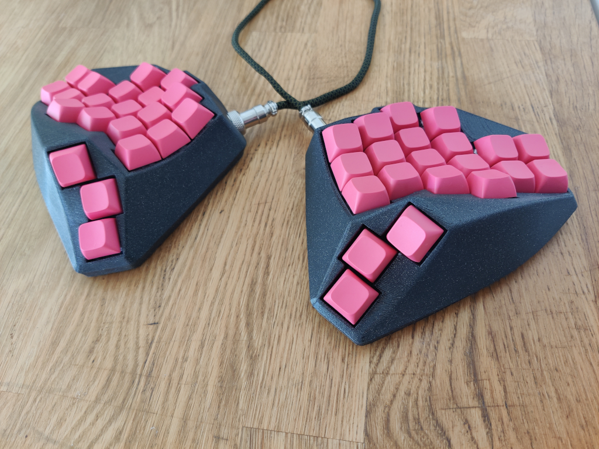

# Smudge

A curved keywell design intended to be handwired.

## 3d printing
The bottom cover has not been scaled to fit. Print it using negative horizontal expansion (-0.2 mm should do) or be ready to sand the edges.

## Materials
__2x QT Py RP2040__  
The XIAO RP2040 or other controllers of the same form-factor might also also work. However, you'll need 10 (6 + 4) pins for wiring the matrix, and enough leftover pins for the communication (I wired the Qwiic to the aviator connector)

__2x GX12 3 or 4 pin connectors__

Beyond that, wiring the matrices takes some diods and wire. Some rubber feet are also recommended to make it stay in place.